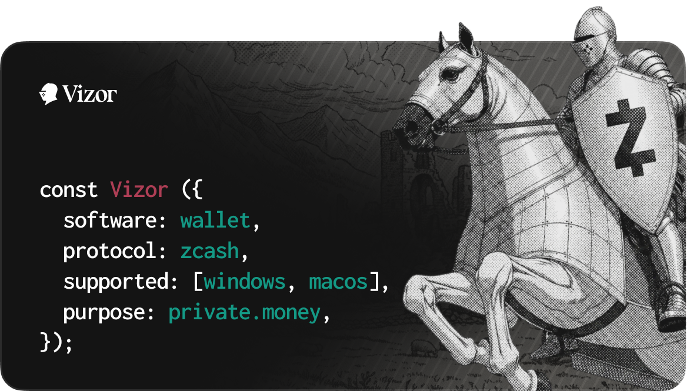

# Vizor

Vizor is a self-custody Zcash wallet for shielded ZEC, with a polished desktop
experience built around clarity, privacy, and ease of use. It is for users who
want to create, receive, shield, and send ZEC without giving a hosted wallet
service control over their funds.

Official public releases currently focus on signed and notarized macOS DMGs.

## Features

- Create or import a Zcash wallet.
- Use a clean, modern interface designed to make shielded Zcash easier to use.
- Receive to shielded Unified Addresses or transparent addresses.
- Send ZEC from shielded balance.
- Add memos when sending to shielded recipients.
- Shield funds received to a transparent address.
- Use multiple accounts in one wallet.
- Import Keystone hardware wallet accounts.
- Choose from preset or custom lightwalletd endpoints.
- View balances, sync progress, and transaction history in a focused desktop
  UI.
- Protect local access with an app password and privacy mode.

## Build From Source

Use the release tag that matches the DMG you want to verify:

```bash
git fetch --tags
git checkout release/vX.Y.Z
git rev-parse HEAD
```

Make sure the commit matches the GitHub release, then build:

```bash
fvm install
fvm flutter pub get
fvm flutter build macos --release \
  --dart-define=ZCASH_DEFAULT_NETWORK=main
```

For testnet:

```bash
fvm flutter build macos --release \
  --dart-define=ZCASH_DEFAULT_NETWORK=test
```

The built app is at:

```text
build/macos/Build/Products/Release/Vizor.app
```

Local builds may not use the same Apple signing identity as the official
release. That is expected. The goal is to verify the source and behavior, not
to produce a byte-for-byte identical app.

## Package a Local DMG

```bash
mkdir -p dist/macos

scripts/package-macos-release-dmg.sh \
  --app-path build/macos/Build/Products/Release/Vizor.app \
  --output dist/macos/Vizor-local-macos.dmg
```

The DMG packaging script must run on macOS in a GUI session.

## Verify an Official DMG

Check the hash:

```bash
shasum -a 256 Vizor-macos.dmg
```

Then verify Apple signing and notarization:

```bash
DMG="Vizor-macos.dmg"

spctl --assess --type open --context context:primary-signature -vv "$DMG"
xcrun stapler validate "$DMG"

hdiutil attach "$DMG" -readonly
APP="/Volumes/Install Vizor Wallet/Vizor.app"

codesign --verify --deep --strict --verbose=2 "$APP"
codesign -dv --verbose=4 "$APP" 2>&1 | egrep 'Identifier|TeamIdentifier|Authority'
spctl --assess --type execute -vv "$APP"
xcrun stapler validate "$APP"

hdiutil detach "/Volumes/Install Vizor Wallet"
```

Expected mainnet identity:

```text
Identifier=com.keplr.vizor
TeamIdentifier=SZTB68DXM4
Authority=Developer ID Application: Chainapsis Inc. (SZTB68DXM4)
```

For testnet, the app path and identifier are:

```text
/Volumes/Install Vizor Testnet Wallet/Vizor Testnet.app
Identifier=com.keplr.vizor.testnet
TeamIdentifier=SZTB68DXM4
```

## Notes

- Back up your mnemonic. Vizor cannot recover funds if you lose it.
- The local password protects this device only. It does not replace the
  mnemonic backup.
- Shielded transactions are scanned locally, but your lightwalletd endpoint can
  still see network metadata such as IP address and request timing.
- Transparent Zcash addresses and transactions are public on-chain.
- Some exchanges only support transparent withdrawals. Shield those funds after
  they arrive.
- Sending uses shielded balance. Transparent funds must be shielded first.
- Keystone accounts require an existing software wallet in this branch.
- Local rebuilds are not expected to match the official DMG byte-for-byte
  because Apple signing, notarization, timestamps, and DMG metadata differ.

## Development

```bash
fvm flutter run
fvm flutter test
fvm flutter analyze

cd rust && cargo test
```

The experimental NEAR Intents swap provider can be pointed at a specific
1Click deployment during local runs:

```bash
fvm flutter run \
  --dart-define=ZCASH_SWAP_1CLICK_BASE_URL=https://1click.chaindefuser.com \
  --dart-define=ZCASH_SWAP_1CLICK_JWT="$ZCASH_SWAP_1CLICK_JWT" \
  --dart-define=ZCASH_SWAP_1CLICK_REFERRAL=<referral-if-used>
```

`ZCASH_SWAP_1CLICK_JWT` in `~/.zshenv` is available to the shell, but the
Flutter app reads it through `String.fromEnvironment`; pass it with
`--dart-define` when launching the app. Reviewing a quote calls the live 1Click
quote API and can return a real one-time deposit instruction. It does not move
funds by itself, and live ZEC auto-deposit remains disabled unless the app is
built with `--dart-define=ZCASH_SWAP_ENABLE_LIVE_FUNDS=true`.

For local app validation, use the wrapper so the shell JWT is forwarded into
the Flutter build:

```bash
scripts/e2e/swap-one-click-live-app.sh -d macos
```

For UI-only inspection without wallet bootstrap or a live 1Click provider:

```bash
fvm flutter run -d web-server -t lib/swap_preview.dart
```

For native desktop inspection, the preview entrypoint also accepts initial tab
and fixture overrides:

```bash
fvm flutter run -d macos -t lib/swap_preview.dart \
  --dart-define=ZCASH_SWAP_PREVIEW_TAB=requests \
  --dart-define=ZCASH_SWAP_PREVIEW_SCENARIO=long
```

`ZCASH_SWAP_PREVIEW_TAB` accepts `swap`, `activity`, or `requests`.
`ZCASH_SWAP_PREVIEW_SCENARIO=long` loads long provider addresses, memos, and
amounts for overflow checks.

For provider live-run validation without opening the wallet UI. The probe
always loads the 1Click token list first. Token-list checks can run without a
JWT. Dry quote and status checks should use the wrapper script so the Dart
probe reads the JWT from the environment instead of a CLI argument. Set
`ZCASH_SWAP_1CLICK_JWT` in the environment before the quote/status runs.

```bash
scripts/e2e/swap-one-click-live-validation.sh --help

scripts/e2e/swap-one-click-live-validation.sh --tokens-only

printf 'ZCASH_SWAP_1CLICK_JWT: '
read -r -s ZCASH_SWAP_1CLICK_JWT
printf '\n'
export ZCASH_SWAP_1CLICK_JWT

ZCASH_SWAP_PROBE_DIRECTION=zec-to-external \
ZCASH_SWAP_PROBE_ASSET=USDC \
ZCASH_SWAP_PROBE_USDC_CHAIN=eth \
ZCASH_SWAP_PROBE_AMOUNT=0.01 \
ZCASH_SWAP_PROBE_DESTINATION=<external-recipient> \
ZCASH_SWAP_PROBE_REFUND=<zec-refund-address> \
  scripts/e2e/swap-one-click-live-validation.sh

ZCASH_SWAP_PROBE_DIRECTION=external-to-zec \
ZCASH_SWAP_PROBE_ASSET=USDC \
ZCASH_SWAP_PROBE_USDC_CHAIN=eth \
ZCASH_SWAP_PROBE_AMOUNT=10 \
ZCASH_SWAP_PROBE_DESTINATION=<zec-staging-recipient> \
ZCASH_SWAP_PROBE_REFUND=<external-refund-address> \
  scripts/e2e/swap-one-click-live-validation.sh

ZCASH_SWAP_PROBE_STATUS_DEPOSIT=<deposit-address> \
  scripts/e2e/swap-one-click-live-validation.sh
```

Set `ZCASH_SWAP_PROBE_ASSET` to `USDC`, `ETH`, `BTC`, `SOL`, `USDT`,
`DAI`, `WBTC`, `NEAR`, or `DOGE` to validate a non-ZEC route leg. ZEC remains
fixed as the other leg.
For any asset shown by `--tokens-only`, set `ZCASH_SWAP_PROBE_ASSET_ID` to the
exact 1Click asset id printed beside that token.

A successful full live-run ends with:

```text
validation summary: tokens=ok quote=ok status=ok
```

Quote-only and status-only runs intentionally report `skipped` for the omitted
path. If the provider returns a deposit memo for the quote, pass it back to the
status check as `ZCASH_SWAP_PROBE_STATUS_MEMO`.

USDC exists on multiple 1Click chains. The provider defaults to Ethereum USDC
to match the prototype copy. For live probes, set
`ZCASH_SWAP_PROBE_USDC_CHAIN=eth|base|arb|near` or pass the exact
`ZCASH_SWAP_PROBE_USDC_ASSET_ID` when validating another chain. This override
only applies to USDC. Prefer the generic `ZCASH_SWAP_PROBE_ASSET_ID` when
validating an arbitrary provider-listed asset.

After changing Rust API files in `rust/src/api/`, regenerate bindings from the
repo root:

```bash
flutter_rust_bridge_codegen generate
```

## License

Apache License 2.0. See [LICENSE](LICENSE).
