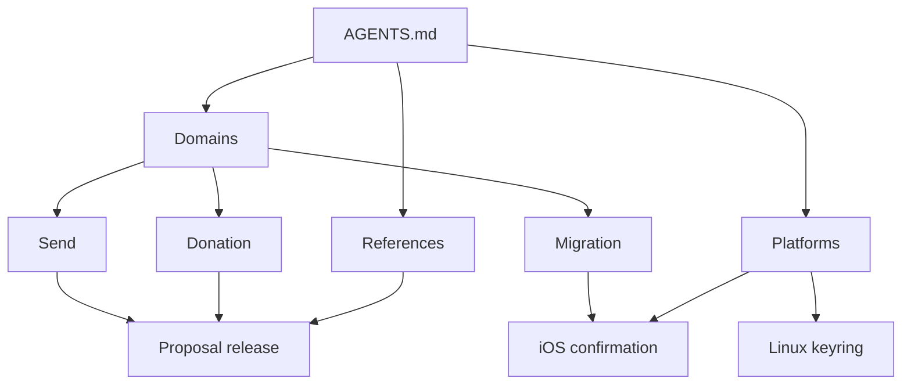

# Vizor 계약 문서 그래프 적용 결과

2026-09-12 · `rowan/agent-contract-docs` · 작업 시작 HEAD `efbc2f3dea804a0a6b94a3a7f42af3feffc9f41b`

**도메인·공통 참조·OS의 세 진입점으로 재구성했다.** 기존 16개 평면 계약과
3개 상세 정본을 세부 문서 76개(계약 74개, 검증 가이드 2개)와 색인 22개로 옮겼다.
같은 공통 규칙을 찾으려고 다른 제품 도메인의 본문을 읽는 경로를 줄였다.

- [제품 도메인](../contracts/domains/index.md)
- [공통 계약](../contracts/references/index.md)
- [OS·환경](../contracts/platforms/index.md)
- [적용 전 설계안](agent-contract-graph-plan-20260912.md)

## 적용한 구조

상위 색인은 질문과 도착 파일을 연결한다. 세부 문서에는 필요한 조건·실패·복구,
코드와 검증 근거를 남겼다. 문서를 이미 알면 색인을 건너뛸 수 있다.
추가 링크는 명시한 변경 조건에 해당할 때만 따른다. 재귀적으로 모든 링크를 읽는
규칙이나 새로운 검색 순서를 강제하지 않는다.

- Send/Donation/Shielding, Receive/Payment requests, Swap/Pay/Gift Cards를 각각 구분했다.
- proposal 수명, PCZT/Keystone, quote/deposit, secret session, mutation barrier,
  sync/잔액, URI/host, UI 규칙은 공유되는 책임별로 분리했다.
- iOS/macOS Keychain, Linux keyring, iOS background Direct를 독립 정본으로 뒀다.
  특정 OS의 migration 전이는 Migration이 소유하고 OS 색인이 직접 연결한다.
- Wallet Link의 전송 형식·세션·import·completion, Voting의 session·서명·실행·
  discovery·proof·cache, Migration의 run·desktop·preparation·iOS·outbox를 구분했다.
- 상세 Voting/Gift Card 문서의 실제 규칙과 검증 명령을 분리했다. 기존 19개 파일은
  중복 정본이나 호환 wrapper로 남기지 않고 제거했다.
- Activity·Address book·Address scan은 독립 계약을 새로 발굴한 영역이 아니다.
  도메인 색인에 소스 진입점만 있는 영역으로 표시했다.

## 원문별 정본 이동

아래 원문 이름은 적용 전 경로다. 과거 견적·실험 보고서는 당시 경로와 측정값을
기록한 자료이므로 일괄 재작성하지 않았다. 현재 탐색에는 아래 도착점을 사용한다.

| 적용 전 | 현재 소유 위치 |
| --- | --- |
| `account-storage.md` | [Accounts](../contracts/domains/accounts/index.md), [Wallet lifecycle](../contracts/domains/wallet/index.md), [account model](../contracts/references/accounts/account-model.md), [wallet DB](../contracts/references/storage/wallet-database.md) |
| `security-lifecycle.md` | [Security](../contracts/domains/security/index.md), [credential policy](../contracts/references/security/credential-policy.md), [storage](../contracts/references/storage/index.md), [platforms](../contracts/platforms/index.md) |
| `lock-sync.md` | [Wallet](../contracts/domains/wallet/index.md), [mutation barrier](../contracts/references/wallet/mutation-barrier.md), [sync](../contracts/references/sync/index.md) |
| `sync-network.md` | [Sync](../contracts/references/sync/index.md), [route policy](../contracts/references/network/route-policy.md), [iOS background transport](../contracts/platforms/ios/background-transport.md) |
| `send.md` | [Send](../contracts/domains/send/index.md) |
| `donation.md` | [Donation](../contracts/domains/donation/index.md) |
| `shielding.md` | [Shielding](../contracts/domains/shielding/flow.md) |
| `send-execution.md` | [Transactions](../contracts/references/transactions/index.md), [desktop Review](../contracts/references/signing/desktop-review-recovery.md), [payment URI holds](../contracts/references/navigation/payment-uri-holds.md) |
| `hardware-signing.md` | [Signing](../contracts/references/signing/index.md), 각 호출 도메인의 추가 조건 |
| `payment-requests.md` | [Payment requests](../contracts/domains/payment-requests/index.md), [Receive](../contracts/domains/receive/request-draft.md), [ZIP-321](../contracts/references/zcash/zip321-codec.md) |
| `swap-pay.md` | [Swap](../contracts/domains/swap/index.md), [Pay](../contracts/domains/pay/index.md), [shared intents](../contracts/references/swaps/index.md) |
| `payment-links.md` | [Gift Cards](../contracts/domains/gift-cards/index.md), [deep-link origin](../contracts/references/navigation/deep-link-origin.md) |
| `wallet-link.md` | [Wallet Link](../contracts/domains/wallet-link/index.md) |
| `voting.md` | [Voting](../contracts/domains/voting/index.md) |
| `migration.md` | [Migration](../contracts/domains/migration/index.md) |
| `ui-platform.md` | [UI](../contracts/references/ui/index.md), [platforms](../contracts/platforms/index.md), [sync progress](../contracts/references/sync/progress.md) |
| `docs/voting-home-discovery.md` | [Discovery](../contracts/domains/voting/home-discovery.md), [configuration](../contracts/domains/voting/home-configuration.md), [regtest guide](../contracts/guides/voting-regtest.md) |
| `docs/voting-participation.md` | [Proof/trust](../contracts/domains/voting/participation-proof.md), [cache/recovery](../contracts/domains/voting/participation-cache.md), [regtest guide](../contracts/guides/voting-regtest.md) |
| `docs/gift-card-claim-outcomes.md` | [Claim outcomes](../contracts/domains/gift-cards/claim-outcomes.md), [verification guide](../contracts/guides/gift-card-outcomes-tests.md) |

## 의미 보존과 검증

결제/서명, 계정·보안·sync/migration을 두 서브에이전트가 각각 담당하고,
주 에이전트가 Wallet Link/Voting/UI와 전체 라우팅을 통합했다. 작성 후 다른
담당자가 원문과 이동 결과를 대조했다. 이번 단계는 기존 계약의 재배치이며,
코드베이스 전체를 다시 감사해 모든 설명의 현재성을 입증한 작업은 아니다.

- Proposal release의 `true`는 Rust 해제와 authoritative balance refresh의 동시 완료다.
  요청 카드의 3초 grace·추가 시도 예외는 카드 정본에 남겼다. 일반 Send 취소로 확대하지 않았다.
- Keystone request ID·ordered message IDs·counts, TEX 두 transaction 연결,
  Sapling params 양쪽 필요, broadcast 후 저장 실패와 blind resend 금지를 보존했다.
- Gift Card prepared txid/expiry의 **proof 이후·broadcast 이전** 기록 조건을
  교차 검수에서 복원했다. ZIP-321과 Gift Card의 FIFO/TTL/reset 차이를 합치지 않았다.
- Mutation의 migration quiesce → voting drain → foreground sync pause,
  DB 삭제 후 reset 실패에서 sync 재개 금지, lock/unlock 전체 순서를 유지했다.
- iOS 알림 성공 → continuation 기록 → task 완료와 계정별 제외 규칙을 한 문서에 유지했다.
  foreground/preparation의 공통 `SYNC_RUNNING` guard도 유지했다.
- 이동 중 빠진 코드 진입점 9개와 기존 검증 디렉터리 링크를 복원했다.
  Voting proof의 pin·시점·불확실성, Gift Card의 기존 데이터 해석을 원문과 대조했다.

활성 계약·색인, 루트, CONTRIBUTING, Rust Voting/E2E 가이드에서 로컬 링크
**582개**를 검사했다. 존재하지 않는 파일/Markdown anchor **0**, 루트에서 도달하지
못하는 계약/색인 **0**, 원문 대비 소스·검증 링크 대상 누락 **0**이다.
링크와 도달성 검사는 의미 보존이나 실제 에이전트의 탐색 성공을 증명하지 않는다.
과거 `docs/plans/`의 당시 경로와 외부 HTTP 링크는 이 검사 범위에서 제외했다.

대표 작업 10개의 계약·의존 집합이 관련 색인과 문서만으로 연결되는지 확인했다.
이 과정에서 Linux reset → mutation barrier → keyring 직접 링크를 보완했다.
AGENTS/CONTRIBUTING과 활성 가이드 참조도 새 정본으로 연결했다.

소스 파일 8개의 이번 변경은 문서 경로를 가리키는 주석뿐임을 작업 직전의 dirty
내용과 대조했다. 실행 코드와 기존의 다른 변경은 보존했다. `git diff --check`를
통과했다. Flutter/Rust 테스트·빌드·regtest·모델 비교는 실행하지 않았다.

## 문서 크기와 대표 읽기 경로

UTF-8 bytes로 측정했다. 토큰·과금·실행 로그 측정이 아니다.
전체 자료를 작게 만드는 것과 작업별로 읽는 자료를 작게 만드는 것은 별도로 본다.

| 표면 | 적용 전 | 적용 후 |
| --- | ---: | ---: |
| 루트 AGENTS | 6,257 | 4,779 |
| 계약과 기존 상세 문서 합계 | 117,645 | 147,379 |
| 별도 라우팅 색인 | 0 | 23,494 |

원문 본문은 최대한 보존했고 파일별 제목·읽는 조건·근거·조건부 링크가 추가되어
전체 문서량은 늘었다. 색인까지 전부 주입하면 이 구조의 목적을 달성할 수 없다.

아래는 각 작업에 필요한 문서 집합의 정적 크기다. 적용 전 열은 해당 기존 파일을
통째로 읽는 경우이며, 기존 부분 읽기보다 우월하다는 비교가 아니다. 코드/테스트
읽기와 반복 호출은 포함하지 않았다. 루트는 양쪽 별도 측정이므로 표에서 제외했다.
Figma는 기존과 새 루트 모두 직접 task-specific 링크를 제공해 색인 비용이 0이다.

| 작업 | 기존 파일 전체 | 새 계약 집합 | 새 색인 | 새 합계 |
| --- | ---: | ---: | ---: | ---: |
| Linux keyring 대기·복구 | 6,240 | 1,798 | 1,802 | 3,600 |
| 앱 링크 host 변경 | 7,414 | 1,389 | 1,802 | 3,191 |
| UI copy 대소문자 | 8,762 | 700 | 2,095 | 2,795 |
| Figma 비교 절차 | 8,762 | 2,285 | 0 | 2,285 |
| Receive USD 가격 소실 후 Create | 8,698 | 2,111 | 1,859 | 3,970 |
| Pay 취소 후 입력 복원과 quote 무효화 | 5,301 | 3,136 | 2,711 | 5,847 |
| Donation Review 취소·proposal 해제 | 8,155 | 3,981 | 2,753 | 6,734 |
| Linux 마지막 계정 삭제·DB 삭제 후 실패 | 17,730 | 9,000 | 2,786 | 11,786 |
| iOS migration 완료 알림 반복 | 8,261 | 3,511 | 3,094 | 6,605 |
| Keystone response ID·message·count 검증 | 4,953 | 1,046 | 2,631 | 3,677 |

Pay의 입력 복원+quote 무효화처럼 여러 계약과 처음 읽는 색인이 필요하면 합계가
기존 파일보다 커질 수 있다. 알려진 계약으로 바로 가면 색인 비용은 빠진다.
따라서 실제 입력 절감률이나 성공률을 이번 수치에서 도출하지 않는다.

검증한 파일 집합은 다음과 같다. 아래 경로는 모두 `docs/contracts/` 기준이며,
나열 순서를 강제하지 않는다.

- **Linux keyring 대기·복구**: `platforms/linux/keyring.md`; 색인 `platforms/index.md`.
- **앱 링크 host 변경**: `references/navigation/deep-link-origin.md`; 색인 `platforms/index.md`.
- **UI copy 대소문자**: `references/ui/copy.md`; 색인 `references/index.md`, `references/ui/index.md`.
- **Figma 비교 절차**: `references/ui/figma-comparison.md`; 색인 없음.
- **Receive USD 가격 소실 후 Create**: `domains/receive/request-draft.md`; 색인 `domains/index.md`.
- **Pay 취소 후 입력 복원과 quote 무효화**: `domains/pay/composer.md`, `references/swaps/quote-validity.md`; 색인 `domains/index.md`, `domains/pay/index.md`.
- **Donation Review 취소·proposal 해제**: `domains/donation/review-status.md`, `references/signing/desktop-review-recovery.md`, `references/transactions/proposal-release.md`; 색인 `domains/index.md`, `domains/donation/index.md`.
- **Linux 마지막 계정 삭제·DB 삭제 후 실패**: `domains/accounts/delete.md`, `domains/wallet/reset.md`, `references/wallet/mutation-barrier.md`, `platforms/linux/keyring.md`, `references/storage/wallet-database.md`; 색인 `domains/index.md`, `domains/accounts/index.md`.
- **iOS migration 완료 알림 반복**: `domains/migration/ios-confirmation.md`; 색인 `domains/index.md`, `domains/migration/index.md`.
- **Keystone response ID·message·count 검증**: `references/signing/keystone-batch-correlation.md`; 색인 `references/index.md`, `references/signing/index.md`.

## 전달 상태

적용은 `vizor-wallet-agent-contract-docs`의 `rowan/agent-contract-docs`에서 끝냈다.
Vizor main과 원격 ref는 변경하지 않았고 커밋·푸시는 하지 않았다.
다음 실제 도메인 작업에서 필요한 정본으로 직접 들어갈 수 있는 상태다.
새 유료 비교 실행이나 추가적인 도메인 스펙 발굴은 이번 완료 범위에 포함하지 않았다.
